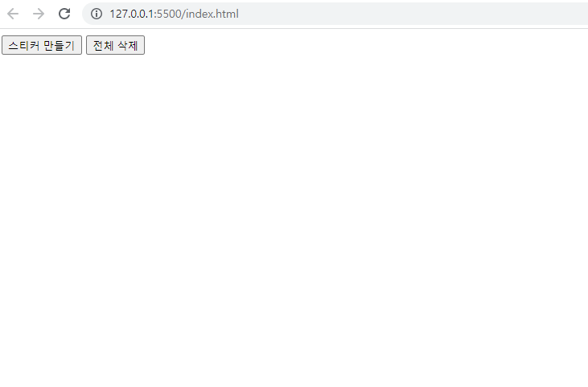

# 과제: 스티커 박스

공부한 내용을 최대한 참고하여 다음을 구현하세요

### 요구 사항

- 스티커 만들기 버튼을 누르면 스티커가 생성됩니다
- 스티커가 겹쳐서 생기는 것을 방지하기 위해 계속 다른 위치에 생성합니다. 예를 들어, 항상 우, 하단 10px씩 이동하여 생성합니다
- 생성된 스티커는 드래그로 원하는 위치로 이동할 수 있습니다
- 스티커는 선택하면 항상 가장 위로 올라옵니다
- 각 스티커에서 항목을 추가하는 버튼이 있습니다
- 각 스티커에는 스티커를 삭제하는 버튼이 있습니다
- 항목을 추가하면 스티커에 항목이 생성됩니다
- 항목은 드래그하여 원하는 위치로 이동할 수 있습니다. 같은 스티커 내 뿐만 아니라 다른 스티커로도 이동이 가능합니다
- 각 항목에는 항목을 삭제하는 버튼이 있습니다
  - 항목 삭제버튼에 대한 이벤트 핸들링을 해당 버튼에 등록하는 것이 아닌 항목에 등록하여 이벤트 위임방식으로 구현해 주세요
- 생성되는 스티커의 배경색은 스티커 구분을 위해 랜덤으로 생성합니다. 다음의 임의의 색을 사용하면 보기 편한 색상이 지정됩니다

  - rgb(150 ~200, 150~200, 150~200)

  
  ## 요구사항

### localStorage 저장

- 현재의 스티커 상태를 localStorage에 저장합니다
  - 스티커의 상태가 변경되는 모든 상황마다 저장해야 합니다. (ex. 이동, 추가, 삭제 등)
  - 스티커의 상태를 관리하기 위해서 객체 지향 프로그래밍으로 스티커와 항목을 클래스로 만들면 좋습니다. 다른 방법을 사용해도 상관없습니다
  - 현재 스티커의 상태를 객체형태의 데이터로 만들어야 합니다. 그래야 문자열로 만들어 localStorage에 저장할 수 있습니다.
- 최초 화면 로드시 localStorage에 저장되어 있는 스티커 정보를 가져와 그대로 다시 복원합니다

### 스티커 제목, 항목 컨텐츠 수정 가능

- 스티커의 제목을 클릭하면 수정 가능하도록 변경됩니다
  - input 박스로 변경이 되고 텍스트 전체가 선택된 상태로 커서가 들어 있도록 합니다
  - 스티커의 제목을 클릭이 아닌 드래그를 하면 수정 모드로 변경되지 않고 스티커가 드래그 됩니다
  - 수정 모드에서 Enter를 치거나 포커스를 잃는 경우 수정 이전 상태로 돌아옵니다.
    - input 박스에 입력된 값으로 제목이 변경됩니다
    - input 박스의 값이 빈 값인 경우 제목은 변경되지 않습니다
- 항목의 컨텐츠를 클릭하면 수정 가능하도록 변경됩니다
  - input 박스로 변경이 되고 텍스트 전체가 선택된 상태로 커서가 들어 있도록 합니다
  - 항목의 컨텐츠를 클릭이 아닌 드래그를 하면 수정 모드로 변경되지 않고 항목이 드래그 됩니다
  - 수정 모드에서 Enter를 치거나 포커스를 잃는 경우 수정 이전 상태로 돌아옵니다.
    - input 박스에 입력된 값으로 컨텐츠가 변경됩니다
    - input 박스의 값이 빈 값인 경우 컨텐츠는 변경되지 않습니다

https://baseweb.design/blog/drag-and-drop-list/

필수 구현

1. 리스트 박스 만들기
2. 스티커는 드래그로 이동 과제로 냈던거는 정렬되게 안해도 된당
3. 삭제 버튼그냥 대놓고 만들어도 된다.
4. 리스트 박스에서 항목 생성
5. 입력했을 때, 팝업 안띄워도 된다. -> 에디터 구현 x, 이름만 바꿀수 있음
6. 항목 드래그 가능
7. 이벤트 발생하면, 서버에 저장

#드래그앤 드롭 참고
https://htmldom.dev/drag-and-drop-element-in-a-list/
https://github.com/phuocng/html-dom/blob/master/assets/demo/drag-and-drop-element-in-a-list/index.html

https://jin-pro.tistory.com/55
https://lihano.tistory.com/19
https://junilhwang.github.io/TIL/Javascript/Design/Vanilla-JS-Component/#_1-%E1%84%87%E1%85%AE%E1%86%AF%E1%84%91%E1%85%A7%E1%86%AB%E1%84%92%E1%85%A1%E1%86%B7%E1%84%8B%E1%85%B3%E1%86%AF-%E1%84%80%E1%85%A1%E1%86%B7%E1%84%8C%E1%85%B5%E1%84%92%E1%85%A1%E1%84%80%E1%85%B5
https://code-anthropoid.tistory.com/204
